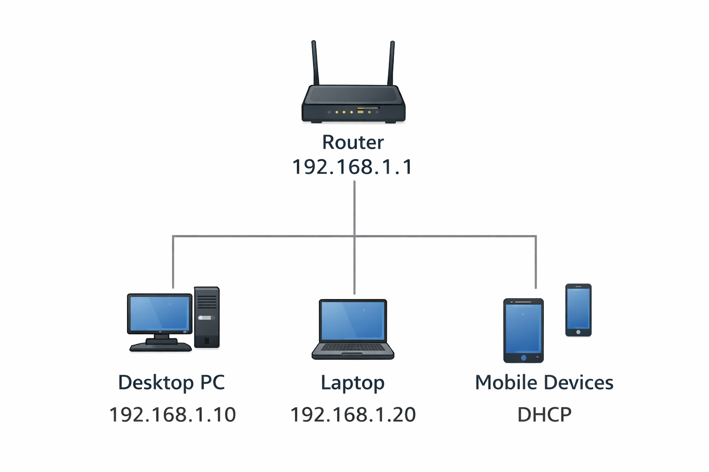
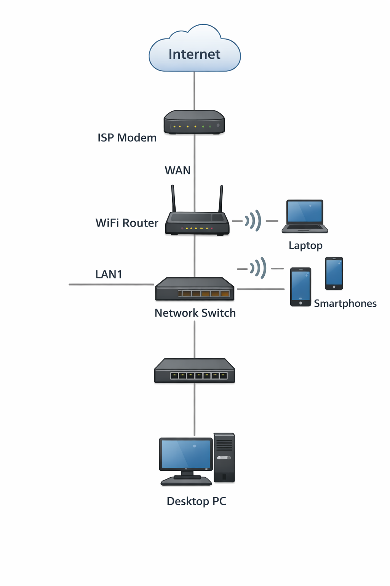

# Home Network Documentation
Author: Bikramjit Singh

---

# 1. Physical Network Topology

This home network is deployed inside a two-room apartment environment. The internet service enters the home through an ISP cable modem located in the living room. The modem connects to a wireless home router that distributes connectivity to both wired and wireless devices.

Physical placement of devices:

Living Room:
- ISP Cable Modem (connected to external internet service line)
- Wireless Router (connected to modem using Ethernet cable)
- Desktop Computer (connected using Cat6 Ethernet cable)
- Smart TV (connected through WiFi)

Bedroom:
- Laptop (connected through WiFi)
- Smartphone (connected through WiFi)
- Tablet Device (connected through WiFi)

A Cisco 2960 switch is also included in the topology to allow additional wired connectivity if required.

Connection media used:
- Wired: Cat6 Ethernet cable
- Wireless: Dual-band WiFi (2.4 GHz and 5 GHz)

---

# 2. Logical Network Topology

The logical structure of this network follows a star topology where all client devices communicate through a central wireless router. The router acts as the main gateway between internal devices and the external internet.

Logical connection flow:

Internet → ISP Cable Modem → Wireless Router → End Devices

Devices connected in the network:

- Desktop PC
- Laptop
- Smartphone
- Tablet
- Smart TV

The wireless router performs the following network functions:

- DHCP address assignment
- Network Address Translation (NAT)
- Wireless access control
- Firewall protection

---

# 3. IP Addressing Scheme

The network uses a private IPv4 addressing structure within the 192.168.1.0/24 subnet.

Network Address:
192.168.1.0/24

Default Gateway:
192.168.1.1

Device IP Allocation Table:

| Device | IP Address | Connection Type |
|--------|-----------|----------------|
Router | 192.168.1.1 | Ethernet |
Desktop PC | 192.168.1.10 | Wired |
Laptop | 192.168.1.20 | Wireless |
Smart TV | 192.168.1.31 | Wireless |
Smartphone | 192.168.1.40 | Wireless |
Tablet | 192.168.1.50 | Wireless |

DHCP Pool Range:
192.168.1.100 – 192.168.1.200

DNS Service:
Automatically assigned by ISP router

---

# 4. Network Devices and Services

The following networking hardware components are used within this environment:

ISP Cable Modem
Provides internet connectivity from the service provider into the home network.

Wireless Router
Acts as the central networking device and provides:

- DHCP services
- NAT translation
- Firewall filtering
- Wireless signal broadcasting

Cisco 2960 Switch
Supports expansion of wired Ethernet connections when additional devices are required.

Desktop Computer
Used primarily for coursework, browsing, and development activities.

Laptop Computer
Provides portable access to the home wireless network.

Smartphone
Used for communication, applications, and internet browsing.

Tablet Device
Used for multimedia consumption and learning applications.

Smart Television
Connected for streaming online content and smart services.

Active network services:

- DHCP (Dynamic IP allocation)
- NAT (Internet access translation)
- Router Firewall Protection
- Wireless Access Point Service

---

# 5. Device Configuration Details

Wireless Router Settings:

Router IP Address:
192.168.1.1

SSID Name:
Home_Network

Wireless Security Mode:
WPA2-Personal Encryption

DHCP Service:
Enabled

Firewall Protection:
Enabled

NAT Service:
Enabled

Desktop PC Configuration:

Connection Type:
Ethernet connection

IP Assignment Method:
Automatic (DHCP)

Laptop Configuration:

Connection Type:
Wireless

IP Assignment Method:
Automatic (DHCP)

Smartphone Configuration:

Connection Type:
Wireless

IP Assignment Method:
Automatic (DHCP)

Tablet Configuration:

Connection Type:
Wireless

IP Assignment Method:
Automatic (DHCP)

Smart TV Configuration:

Connection Type:
Wireless

IP Assignment Method:
Automatic (DHCP)

---

# 6. Physical Device Locations

Router location: Living room TV cabinet  
Desktop PC location: Study desk (living room)  
Laptop location: Bedroom workspace  
Smartphone location: Mobile device (used throughout apartment)  
Tablet location: Bedroom side table  
Smart TV location: Living room entertainment unit  

---

# 7. Secure Storage of Login Credentials

All administrative and wireless network credentials are securely stored using Microsoft Edge Password Manager protected by multi-factor authentication.

Additional security measures implemented:

- Default router administrator credentials changed
- Strong wireless password configured
- WPA2 encryption enabled for wireless access
- Two-factor authentication enabled for saved credentials
- Password auto-fill protection enabled on trusted devices only

---

